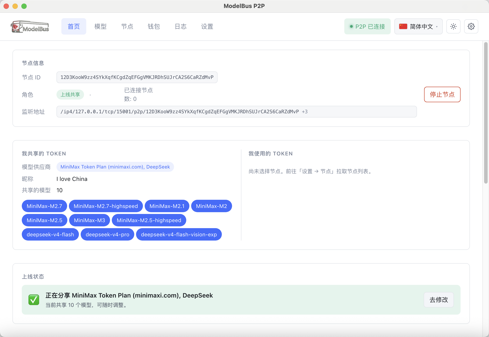
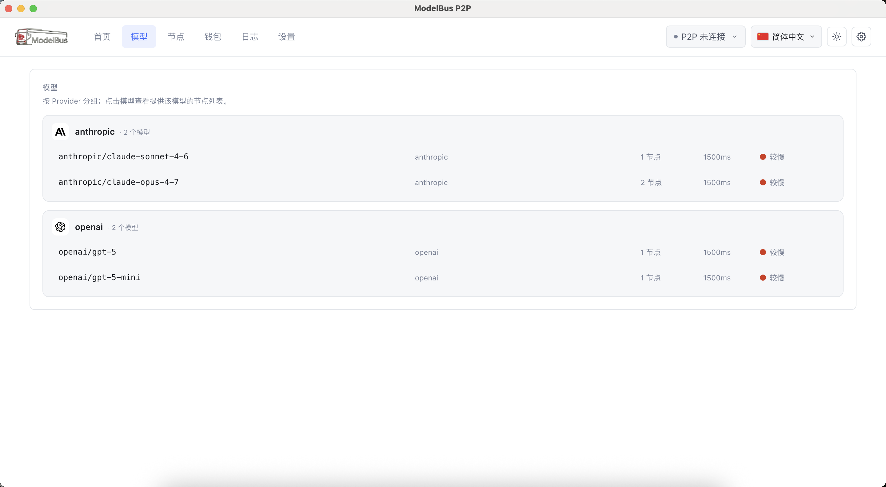
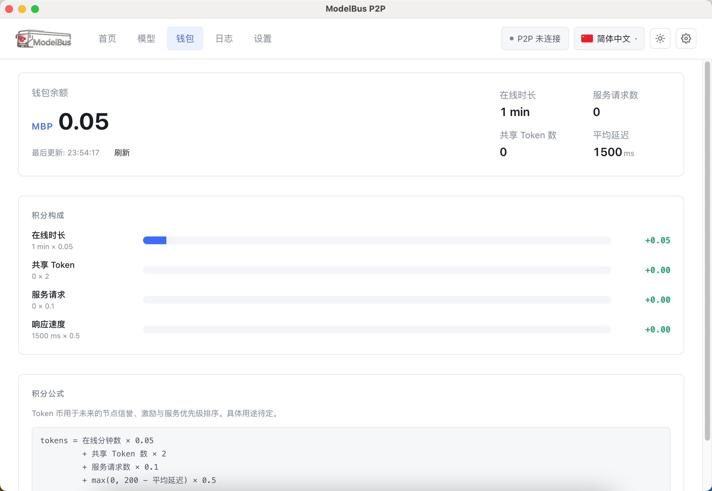
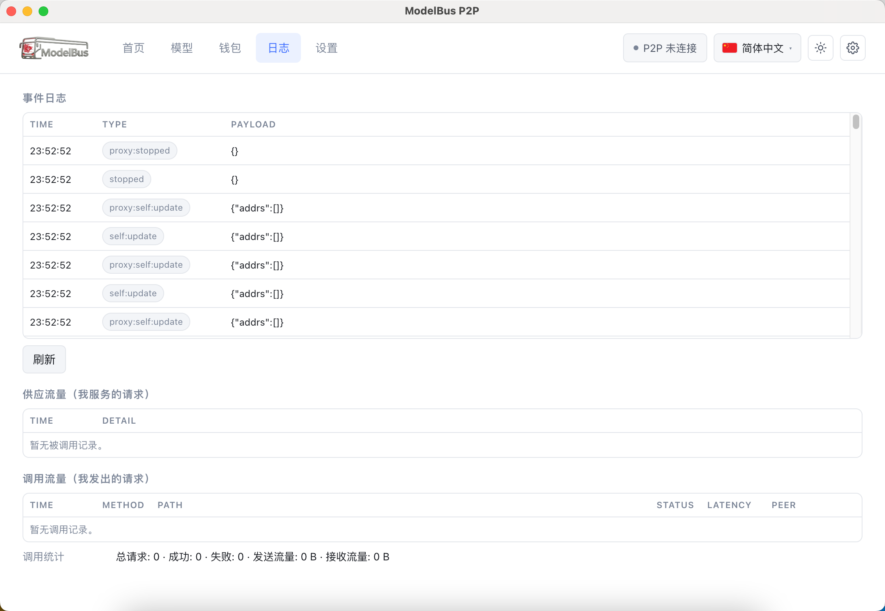
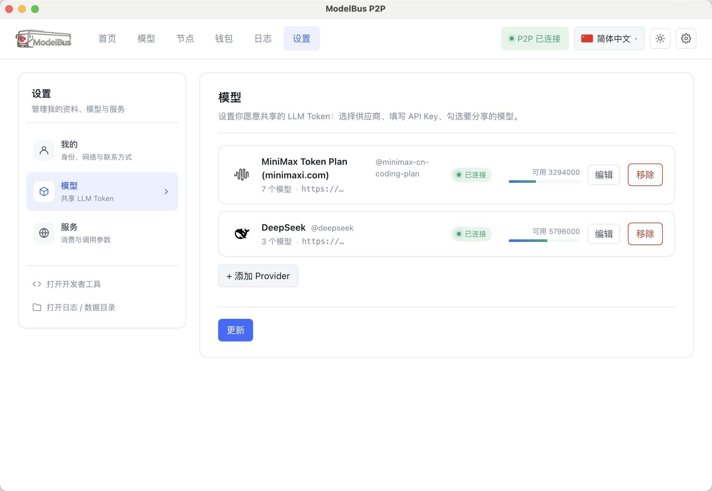

<!-- i18n: vi-VN (Tiếng Việt) -->
<p align="center">
  
</p>
<p align="center" style="font-weight: bold;">
  ModelBus-P2P : Nền tảng chia sẻ Token LLM phi tập trung
</p>
<p align="center">
Có thể là nền tảng đầu tiên trên thế giới, nơi bất kỳ ai cũng có thể gắn Token của mình vào mạng P2P và đổi lại sử dụng Token được chia sẻ bởi các peer khác. Không có máy chủ trung tâm, không cần đăng ký tài khoản, không có API key nào rời khỏi máy của bạn.
</p>

> ⚠️ **Trạng thái dự án (v1 thử nghiệm)**: ModelBus-P2P vẫn đang trong giai đoạn phát triển và thử nghiệm công khai. Các thành phần wire-format (giao thức `/modelbus/inference/1.0.0`, schema thông báo nút v2, danh sách trust-root) có thể nhận các bản cập nhật không tương thích trong tương lai; các peer được thông báo dưới phiên bản cũ có thể cần đăng ký lại.

---

## Contents
- [这是什么](#这是什么)
- [核心特性](#核心特性)
- [界面一览](#界面一览)
- [架构总览](#架构总览)
- [去中心化设计](#去中心化设计)
- [节点公告格式（v2）](#节点公告格式v2)
- [调用流程详解](#调用流程详解)
- [Tải về và sử dụng (sắp ra mắt)](#tải-về-và-sử-dụng-sắp-ra-mắt)
- [目录结构](#目录结构)
- [快速开始](#快速开始)
- [配置说明](#配置说明)
- [开发与调试](#开发与调试)
- [其他语言的 README](#其他语言的 README)
- [路线图](#路线图)
- [许可](#许可)

## Other-language READMEs
本仓库的 README 已翻译为 22 种语言，详见下方。当前文档语言：`zh-CN`。

- [English](README.en-US.md) · [繁體中文](README.zh-TW.md) · [日本語](README.ja-JP.md) · [한국어](README.ko-KR.md)
- [Deutsch](README.de-DE.md) · [Español](README.es-ES.md) · [Français](README.fr-FR.md) · [Italiano](README.it-IT.md) · [Dansk](README.da-DK.md)
- [Polski](README.pl-PL.md) · [Русский](README.ru-RU.md) · [Bosanski](README.bs-BA.md) · [العربية](README.ar-SA.md) · [Norsk](README.nb-NO.md)
- [Português (Brasil)](README.pt-BR.md) · [ไทย](README.th-TH.md) · [Türkçe](README.tr-TR.md) · [Українська](README.uk-UA.md) · [বাংলা](README.bn-BD.md)
- [Ελληνικά](README.el-GR.md) · [Tiếng Việt](README.vi-VN.md)

应用内可点击顶栏 🌐 国旗按钮即时切换。

***

## What is it
ModelBus-P2P 是一个基于 [js-libp2p](https://github.com/libp2p/js-libp2p) + Electron 的桌面客户端。它解决的是一个非常普遍的问题：**这个月我用不完，下个月我又不够用**。

> 场景：你订阅了 OpenAI 或 Claude，本月额度没用完。与其让它月底清零，不如把它挂上 P2P 网络，本月用出去的每一笔请求都会按规则折算成 **MBP 积分**（在线时长 × 0.05 + 共享 Token 数 × 2 + 服务请求数 × 0.1 + 响应速度 × 0.5）。下个月当你的订阅不够用时，你可以用积分去调用其他节点共享的 Token。整个过程不经过任何中心服务器，API Key 始终留在你自己的机器上。

- **上线（Provision / Share）**：把你订阅的 API Key + 想共享的模型挂到 P2P 网络，告诉大家你的 peerId。
- **调用（Consume / Drive）**：在本机启一个 OpenAI 兼容的 HTTP 代理，配置 `http://127.0.0.1:18100` 作为 base\_url，所有请求都会经 P2P 转发到真实持有 Token 的节点去执行。
- **钱包（Wallet）**：你每次共享 / 调用，都会按规则折算为 MBP 积分。首页和「钱包」页实时展示余额、积分构成与计算公式。积分当前为记账，未来可用于节点信誉、激励、付费路由等用途。
- **不需要任何人审批**：首次启动通过官方 endpoint（或本地 mock）拿到种子节点，之后完全 P2P 运行。

***

## Core features
| 特性                 | 说明                                                                                 |
| ------------------ | ---------------------------------------------------------------------------------- |
| **P2P 传输栈**        | TCP + WebSocket + Circuit Relay v2 + UPnP/NAT 穿透 + Kademlia DHT + AutoNAT          |
| **去中心化信任**         | 4 个硬编码的种子节点作为信任根；新节点通过信任链（下一阶段）扩展网络                                                |
| **冷启动保底**          | 首次启动从官方 HTTPS endpoint（或本地 mock）获取节点；之后所有内容在 `<userData>/bootstrap-cache.json` 中缓存 |
| **多 Provider 路由**  | 同一个节点可同时挂 OpenAI + Anthropic + Google 的 Key；调用方按 `model.id` 自动路由                   |
| **OpenAI 兼容代理**    | 消费端本地启 OpenAI 兼容的 HTTP 代理（默认 `:18100`），任何 OpenAI/Anthropic 兼容客户端都能直连               |
| **API Key 鉴权**（可选） | 消费端可设置固定 API Key，调用方必须在 `Authorization: Bearer <key>` 头携带                          |
| **22 种语言**         | 默认中文（zh-CN），含 RTL 阿拉伯语支持                                                           |
| **现代浅色默认主题**       | 白天模式默认，可切换深色 / 跟随系统                                                                |

***

## Screenshots
| <br />           | <br />                                         |
| ---------------- | ---------------------------------------------- |
| **首页（Home）**     | 节点信息 · 我共享/使用的 Token · 上线引导 · API 服务说明 · 节点排行榜 |
| **模型（Models）**   | 合并所有节点公告的可用模型 + 节点质量列表（速度、模型、稳定时长）             |
| **钱包（Wallet）**   | MBP Token 余额 · 积分构成 · 公式说明                     |
| **日志（Logs）**     | 事件日志 + 供应流量（我服务的请求）+ 调用流量（我发出的请求）              |
| **设置（Settings）** | 节点 · 注册 · Token 上线 · 调用服务（API Key）             |

### 首页



首页由 5 个紧凑区块组成，**不需要滚动即可一屏看完**：

1. **节点信息**：peerId、监听地址、连接数、启动/停止按钮
2. **我共享的 Token / 我使用的 Token**：左右对比，本地 provision 与 consume 目标一目了然
3. **上线状态引导**：未上线时橙色 CTA（去设置页启动），已上线时绿色状态 + 跳到设置修改
4. **开放调用服务**：API Key 状态、模型 chips、端口、URL、可一键复制的 curl 示例
5. **排行榜**：节点按质量排序（100ms 内=100 分；1500ms+=0 分）

### 模型



- 顶部卡片网格展示模型 id + provider + 节点数 + 平均延迟；质量用彩色圆点（绿/橙/红）表示
- 底部表格展示每个节点的 nickname / provider / 模型 chips / 质量条 / 在线时长 / 请求数 / 延迟

### 钱包



- 大号 MBP 余额显示 + 4 维统计（在线时长、已服务请求、共享 Token 数、平均延迟）
- 积分构成条形图（在线 × 0.05 / 共享 Token × 2 / 请求 × 0.1 / 速度 × 0.5）
- 公式文本展示，未来链上公式可能调整时本页透明更新

### 日志



- 事件日志：所有 EventBus 事件（启动/停止/provision/代理流量等）
- 供应流量：我作为 Token 持有方，被其他节点调用过的请求
- 调用流量：我作为消费方，向其他节点发出的请求

### 设置



四个子标签：

- **节点**：registry URL、TCP 监听端口、本代理端口、引导 multiaddr
- **注册**：信任节点列表（来自官方 endpoint + 本地缓存），按 hard-coded trust root 校验
- **Token 上线**：选择 provider / 输入 API Key / 勾选要共享的模型
- **调用服务**：设置固定 API Key 用于鉴权

***

## Architecture
```
┌─────────────────────────────────────────────────────────────────┐
│  Electron Renderer (Vue 3)                                       │
│  ┌──────┬──────────┬──────────┬────────┬──────────┐              │
│  │ Home │  Models  │  Wallet  │  Logs  │ Settings │              │
│  └──────┴──────────┴──────────┴────────┴──────────┘              │
│                       │  ipcRenderer.invoke / on                  │
└───────────────────────┼─────────────────────────────────────────┘
                        ▼
┌─────────────────────────────────────────────────────────────────┐
│  Electron Main (Node.js)                                         │
│                                                                  │
│   preload (contextBridge)                                       │
│        │                                                          │
│   ipcMain  ───►  services/                                       │
│                  ├─ providers  (models.dev cache)                │
│                  ├─ registry   (official API + cache fallback)  │
│                  ├─ p2p         (libp2p daemon)                    │
│                  ├─ provisioner (multi-provider router)        │
│                  ├─ proxy-server (OpenAI compatible HTTP)       │
│                  ├─ upstream   (real provider API calls)        │
│                  ├─ wallet     (MBP score calculator)           │
│                  ├─ models     (catalogue aggregator)           │
│                  └─ store      (JSON persistence)                │
│                                                                  │
│   proto/inference.ts                                             │
│        └─ /modelbus/inference/1.0.0  (custom libp2p protocol)   │
└─────────────────────────────────────────────────────────────────┘
                        │  libp2p
                        ▼
                 ┌──────────────────┐
                 │   P2P Network     │
                 │  (TCP / WS / ...) │
                 └──────────────────┘
```

### 关键文件

| 层   | 文件                                     | 作用                                        |
| --- | -------------------------------------- | ----------------------------------------- |
| 类型  | `src/shared/types.ts`                  | 跨进程共享类型（v2 NodeAnnouncement 等）            |
| 协议  | `src/main/proto/inference.ts`          | 自定义 libp2p 协议 `/modelbus/inference/1.0.0` |
| P2P | `src/main/services/p2p.ts`             | libp2p 节点生命周期                             |
| 信任  | `src/main/services/registry.ts`        | 双源 bootstrap（官网 + 本地缓存） + 信任校验            |
| 缓存  | `src/main/services/bootstrap-cache.ts` | `<userData>/bootstrap-cache.json`         |
| 上线  | `src/main/services/provisioner.ts`     | 按 model.id 多 provider 路由                  |
| 消费  | `src/main/services/proxy-server.ts`    | OpenAI 兼容本地 HTTP 代理                       |
| 上游  | `src/main/services/upstream.ts`        | 真实 LLM provider API 调用                    |
| 钱包  | `src/main/services/wallet.ts`          | MBP 积分计算                                  |
| 模型  | `src/main/services/models.ts`          | 模型/节点目录聚合                                 |
| UI  | `src/renderer/src/views/*.vue`         | 5 个视图（Home/Models/Wallet/Logs/Settings）   |
| 桥   | `src/preload/index.ts`                 | contextBridge 类型化桥                        |

***

## Decentralised design
### 信任根（Trust Roots）

应用二进制内硬编码 **4 个种子节点的 peerId**。来源：`src/main/config/trusted-roots.ts`。每次启动时：

1. 尝试从配置的 `registryUrl`（官方 HTTPS 或 `file://` mock）拉取节点列表
2. 任何 peerId **不在** `TRUSTED_ROOT_PEER_IDS` 的节点会被标记为 `unverified`
3. 已拉取的 trusted 子集写入 `<userData>/bootstrap-cache.json`
4. 下次启动在网络不可达时仍可 warm-start

```
4 个 hard-coded roots    ← 起点
└─ cached from official endpoint
   ├─ direct connect via bootstrapMultiaddrs
   ├─ mDNS (LAN discovery)
   └─ libp2p DHT findProviders (P2P pure)
```

### 冷启动到全 P2P 的渐进

```
首次启动
  │
  ├─ local cache empty
  │
  ├─ Step A: 并发拉取
  │   ├─ GET https://modelbus.cc/api/v1/nodes    ← 官网（保底）
  │   ├─ user-configured bootstrap multiaddrs
  │   └─ mDNS / LAN discovery
  │
  ├─ Step B: validateTrust(node) — 比对 trustedRoots
  │
  ├─ Step C: 写 cache
  │
  └─ Step D: P2P daemon 启动
      ├─ 命中：纯 P2P
      └─ 未命中：每 1h 后台重试官网
```

**官网永远保留**，作为冷启动救援通道。即使整个 P2P 网络瘫痪，新用户仍能通过官网加入。

***

## Node announcement schema (v2)
`GET https://modelbus.cc/api/v1/nodes` 返回 `Array<NodeAnnouncement>`：

```json
[
  {
    "version": 2,
    "peerId": "12D3KooW...",
    "nickname": "alpha-share",
    "providers": [
      {
        "providerId": "openai",
        "providerName": "OpenAI",
        "models": [
          { "id": "openai/gpt-5",       "name": "GPT-5" },
          { "id": "openai/gpt-5-mini", "name": "GPT-5 mini" }
        ]
      },
      {
        "providerId": "anthropic",
        "providerName": "Anthropic",
        "models": [
          { "id": "anthropic/claude-opus-4-7", "name": "Claude Opus 4.7" }
        ]
      }
    ],
    "addr": {
      "addr":      "/ip4/127.0.0.1/tcp/15001/p2p/12D3KooW...",
      "kind":      "direct",
      "transport": "tcp",
      "lastSeen":  1735689600000
    },
    "announcedAt": 1735689600000,
    "expiresAt":   1735862400000
  }
]
```

字段含义：

| 字段                          | 类型     | 说明                                                |
| --------------------------- | ------ | ------------------------------------------------- |
| `version`                   | `2`    | schema 版本，破坏性变更时 +1                               |
| `peerId`                    | string | libp2p PeerId，唯一身份                                |
| `nickname`                  | string | 用户可读昵称                                            |
| `providers[]`               | array  | 该节点挂载的 LLM 供应商列表                                  |
| `providers[].providerId`    | string | models.dev 里的 provider id（如 `openai`）             |
| `providers[].providerName`  | string | 可读显示名                                             |
| `providers[].models[]`      | array  | 该 provider 下愿意共享的模型                               |
| `providers[].models[].id`   | string | 模型 id（**真实发送给上游的标识**）                             |
| `providers[].models[].name` | string | UI 展示用                                            |
| `addr`                      | object | 单个主要可达地址（不复数；一节点一地址）                              |
| `addr.addr`                 | string | libp2p multiaddr 字符串                              |
| `addr.kind`                 | string | `direct` / `relay` / `unknown`                    |
| `addr.transport`            | string | `tcp` / `ws` / `quic` / `webtransport` / `webrtc` |
| `addr.lastSeen`             | number | 最后一次观察到该地址可达的 Unix ms                             |
| `announcedAt`               | number | 该条目最近一次刷新                                         |
| `expiresAt`                 | number | 软过期；客户端仍可消费过期条目，但应降低权重                            |

**mock 末尾预填了 4 个 trusted seed 节点**，与 `trusted-roots.ts` 中的 peerId 对齐，保证 `pnpm run dev` 无需联网即可启动。

***

## Request flow
### 上线（你 = Token 持有方）

```
Settings → Token 上线
   │
   ├─ 选 provider（openai / anthropic / ...）
   ├─ 输入 API Key
   ├─ 勾选要共享的模型（每 provider 一组）
   │
   ▼
ipc: provision:set
   │
   ├─ ProvisionerService.register(config)
   │   └─ node.handle('/modelbus/inference/1.0.0', serveInference(req => this.handle(req)))
   │
   └─ 上线成功 → events: 'provision:registered'
   │
   ▼
Settings → 注册
   └─ 列出你的 peerId，提示其他用户选择
```

### 调用（你 = Token 消费方）

```
Models 标签 / 排行榜
   │
   ├─ 选一个 trusted 节点
   │
   ▼
ipc: proxy:setTarget(peerId)
   │
   ├─ ConsumerProxy.setTarget(flatNode)
   ├─ ConsumerProxy.start(:18100)
   │
   ▼
Local HTTP Proxy :18100
   │
   ├─ 收到 HTTP POST /v1/chat/completions
   │   └─ 提取 body.model → dialPeer(targetPeerId) → open libp2p stream
   │       └─ 写入 InferenceRequest{encode by JSON+lp}
   │       └─ 阻塞读取 InferenceResponse
   │
   └─ 把 response 写回 HTTP 客户端
```

**请求路由**（在被叫节点的 `ProvisionerService.handle`）：

```
request.model = "openai/gpt-5"
   │
   └─ resolveProvider("openai/gpt-5")
       ├─ 匹配：openai provider 配置 (config.apiKey="sk-...")
       │   └─ buildUpstreamCall(openai, key, path, method, headers, body)
       │       └─ https://api.openai.com/v1/chat/completions + Bearer sk-...
       │   └─ 真实调用，返回响应
   │
   └─ 不匹配：400 + { error: "model X is not hosted by this peer" }
```

**关键设计**：consumer 不知道被叫节点挂载了哪些 provider / model，请求里只带 `model` 字段。被叫节点按 `resolveProvider(modelId)` 自动分发。同节点挂多 provider 时，同 model id 不会重复（每个 provider 的 `config.modelIds` 由用户自己勾选，不重叠）。

***

## Tải về và sử dụng (sắp ra mắt)

undefined
## Project layout
```
modelbus-p2p/
├── docs/
│   └── image/             # README 截图（home / model / wallet / logs / settings / logo）
├── mock/
│   └── nodes.json         # v2 schema 示例，末尾含 4 个 trusted seed
├── scripts/
│   ├── i18n-update.mjs    # 旧 i18n 批量更新脚本
│   └── i18n-expand.mjs    # 新 i18n 批量更新脚本
├── src/
│   ├── main/              # Electron 主进程
│   │   ├── config/
│   │   │   └── trusted-roots.ts
│   │   ├── proto/
│   │   │   └── inference.ts
│   │   ├── services/
│   │   │   ├── bootstrap-cache.ts
│   │   │   ├── models.ts
│   │   │   ├── providers.ts
│   │   │   ├── proxy-server.ts
│   │   │   ├── provisioner.ts
│   │   │   ├── p2p.ts
│   │   │   ├── registry.ts
│   │   │   ├── store.ts
│   │   │   ├── upstream.ts
│   │   │   └── wallet.ts
│   │   ├── index.ts        # 主进程入口
│   │   └── ipc.ts          # 所有 IPC handler
│   ├── preload/
│   │   └── index.ts        # contextBridge 类型化桥
│   ├── renderer/           # Electron 渲染进程
│   │   ├── index.html
│   │   ├── public/
│   │   │   ├── logo.png    # 顶栏 logo
│   │   │   └── flags/      # 22 个国旗 SVG
│   │   └── src/
│   │       ├── App.vue
│   │       ├── i18n/       # 22 个语言字典
│   │       ├── ui/         # 通用组件（FlagIcon / ThemeIcon）
│   │       └── views/      # 5 个视图
│   └── shared/
│       └── types.ts        # 跨进程类型
├── README.md               # 本文件
├── electron.vite.config.ts  # electron-vite 三段构建配置
├── package.json
├── tsconfig.json
└── tsconfig.{node,web}.json
```

***

## Quick start
### 准备

- Node.js ≥ 22
- pnpm ≥ 9（推荐；npm 也可，但 pnpm 对 Electron 后安装步骤更稳）

### 安装 + 开发

```bash
# 安装依赖（会自动下载 Electron 二进制；已配置 ELECTRON_MIRROR）
pnpm install

# 启动 dev（HMR 热更新）
pnpm run dev
```

应用启动后默认指向 `file://./mock/nodes.json`，**无需任何网络**即可体验完整流程：

1. 进入 **设置 → 节点**，确认 registry URL 是 `file://./mock/nodes.json`
2. 进入 **设置 → 注册**，应看到 6 个节点（4 个 `Trusted` + 2 个 `Unverified`）
3. 进入 **设置 → Token 上线**，随便填一个假 API Key、勾选几个模型 → 上线
4. 回到 **首页**，第 4 块会显示你的 API 服务端口 + curl 示例

### 打包

```bash
# macOS dmg
pnpm run package:mac

# Windows nsis
pnpm run package:win

# Linux AppImage
pnpm run package:linux
```

构建产物在 `release/`。

### 类型检查

```bash
pnpm run typecheck   # 双侧（主进程 + 渲染进程）零错误检查
```

***

## Configuration
### `BootstrapConfig`（持久化在 `<userData>/modelbus-store.json`）

| 字段                    | 默认                                 | 说明                                             |
| --------------------- | ---------------------------------- | ---------------------------------------------- |
| `registryUrl`         | `http://localhost:8089/nodes.json` | 节点列表拉取地址。开发期可改为 `file://./mock/nodes.json` 走本地 |
| `bootstrapMultiaddrs` | `[]`                               | 启动时连接的额外种子 multiaddr 列表                        |
| `tcpPort`             | `15001`                            | 本节点 libp2p TCP 监听端口                            |
| `proxyPort`           | `18100`                            | 消费端 OpenAI 兼容代理端口                              |

修改任一项后**重启 P2P 节点**生效。

### API Key（消费端鉴权，可选）

`localStorage` 中 `modelbus.consumer.apiKey`。
消费端 HTTP 代理（`:18100`）会校验：

```bash
curl http://127.0.0.1:18100/v1/chat/completions \
  -H "Authorization: Bearer <your-api-key>" \
  -H "Content-Type: application/json" \
  -d '{"model":"<id>","messages":[{"role":"user","content":"hi"}]}'
```

### Trusted Roots（信任根）

`src/main/config/trusted-roots.ts`。**生产环境**必须替换为模型维护者真实运行的 4 个节点 peerId。客户端启动时检查：

- 任何 peerId 在此列表 → `trusted = true`
- 否则 → `trusted = false`（UI 标"待验证"）

***

## Development & debugging
### 系统菜单

顶栏右侧第三个按钮（⚙ 齿轮）：

- **打开开发者工具** — 在 detached 窗口弹出 DevTools，方便多屏调试
- **打开日志 / 数据目录** — 弹出 `<userData>` 目录（含 `modelbus-store.json`、`bootstrap-cache.json`）

设置页右上角也提供同样的两个快捷按钮。

### 调试 libp2p

```bash
# 详细 libp2p 日志
DEBUG="libp2p:*" pnpm run dev

# 仅连接 / DHT
DEBUG="libp2p:connection-manager:*,libp2p:kad-dht:*" pnpm run dev
```

### 添加自定义 Provider

当前 Provider 列表从 [models.dev](https://github.com/anomalyco/models.dev) 动态拉取。若需要自定义 provider（如自部署 OpenAI 兼容服务），直接在 Settings → Token 上线 时手动指定 `API 地址覆盖`（如 `https://my-llm.example.com/v1`）即可。

### 修改 Mock

`mock/nodes.json` 是 v2 schema 的实例。改完后只需重启 dev。`pnpm run dev` 启动时会自动 fetch 一次并显示在 Settings → Register。

***

## Languages
内置 **22 种语言**，默认 `zh-CN`：

| 语言                 | 语言       | 语言       |
| ------------------ | -------- | -------- |
| 简体中文               | 繁體中文     | English  |
| 한국어                | Deutsch  | Español  |
| Français           | Italiano | Dansk    |
| 日本語                | Polski   | Русский  |
| Bosanski           | العربية  | Norsk    |
| Português (Brasil) | ไทย      | Türkçe   |
| Українська         | বাংলা    | Ελληνικά |
| Tiếng Việt         | <br />   | <br />   |

切换：顶栏右侧第一个按钮（🌐 国旗图标）。语言选择持久化到 localStorage。

新增语言：在 `src/renderer/src/i18n/` 下新建 `xx-XX.ts`，按 `Dict` 类型补全条目，并在 `src/renderer/src/i18n/index.ts` 的 `availableLocales` 与 `dictionaries` 注册。

***

## Roadmap
| 阶段       | 目标                                                |
| -------- | ------------------------------------------------- |
| **v1** ✅ | 多 provider、官网冷启动、信任根、P2P 转发、22 语言、钱包雏形            |
| **v2**   | 信任链（trustChain）— 基于 Ed25519 签名的链式邀请账本，新节点通过被引荐人入网 |
| **v3**   | 节点质量评估接入真实指标（上传延迟、错误率、运行稳定性），淘汰低质量节点              |
| **v4**   | Token 经济学闭环 — MBP 用于：优先路由、加速新节点冷启动、付费节点发现         |
| **v5**   | 移动端（P2P 节点） — 让手机也能上线                             |
| **v6**   | Web 端 — 浏览器内 `<modelbus>` JS SDK                  |

***

## License
[MIT](./LICENSE)
